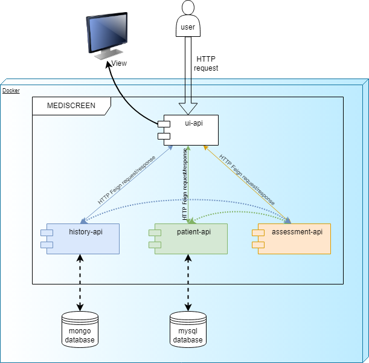
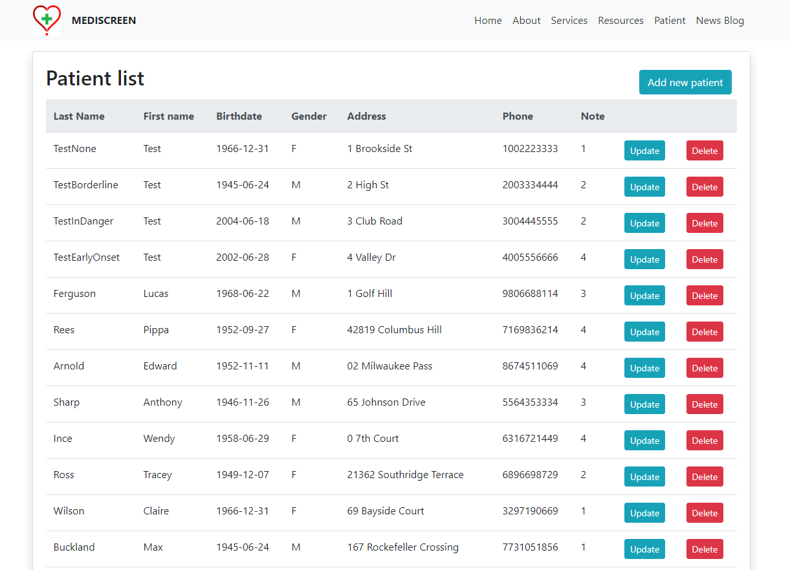
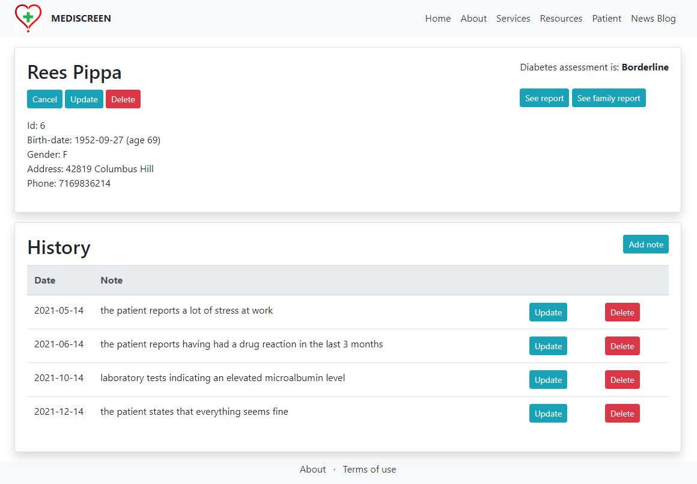

<!-- PROJECT LOGO -->
<br />
<div align="center">
  <a href="#">
    
  </a>

<h1 align="center">MediScreen</h1>

  <p align="center">
    <a href="https://github.com/GAulombard/OC_P9_Mediscreen/issues">Report Bug</a>
    ·
    <a href="https://github.com/GAulombard/OC_P9_Mediscreen/pulls">Request Feature</a>
  </p>
</div>

<!-- ABOUT THE PROJECT -->
## About The Project

Mediscreen is a springBoot application using a multi-service architecture. This application allow doctors/practitioners to fetch personals informations on a list patients. Depending the informations, the application can generate a diabetes report.


<p align="right">(<a href="#top">back to top</a>)</p>


### Built With


* [SpringBoot 2.5.6](https://spring.io/projects/spring-boot)
* [Java 11](https://www.java.com/fr/)
* [Gradle 7.3](https://gradle.org/)
* [Docker desktop community Version 2.0.0.0-win81 (29211)](https://www.docker.com/products/docker-desktop)
* [MySql](https://www.mysql.com/fr/)
* [MongoDB](https://www.mongodb.com/)
* [Thymeleaf](https://www.thymeleaf.org/)


<p align="right">(<a href="#top">back to top</a>)</p>


### Architecture

Mediscreen use 4 different micro-services :

* **UI-API**: this microservice handles the user interface part of the application, it receives all HTTP requests from the user, send http request to others services, get the responses and modify the view.
* **PATIENT-API**: this microservice allows patient information management, like add, update and delete patient information. This service use MySQL database to store information. 
* **HISTORY-API**: this microservice handles the history of each patient. It allows practitioners/doctors to add, update, delete notes about patient. Notes are stored in a MongoDb database.
* **ASSESSMENT-API**: this part of the application is used to gather all information about a patient (personal and history) in order to calculate the risk level to have diabetes.



<p align="right">(<a href="#top">back to top</a>)</p>

### Diabetes calculation logic

This is the logic to calculate the diabetes risk level based on "conditions". Just follow the lines and answer the question by "yes" or "no" until you get the result. 


<p align="right">(<a href="#top">back to top</a>)</p>

<!-- GETTING STARTED -->
## Getting Started

### Installation

1. First, create a new directory, and go into it.

```bash
cd /path/to/directory/yourProjectName
```

2. Clone the project using:

```bash
git clone https://github.com/GAulombard/OC_P8_Mediscreen.git
```

3. Use the following command to run the app:

```bash
 docker-compose up -d --build 
```

4. For the first time, execute the following CURL command to fill-in the mongodb database with few notes (find those here "./resources/curlAddNote.txt").
You can as well run those CURL commands online, [reqbin.com](https://reqbin.com/curl)
```
curl -X POST "http://localhost:8082/history/validate" -H  "Content-Type: application/json" -d "{  \"note\": \"Patient: TestNone Practitioner's notes/recommendations: Patient states that they are 'feeling terrific' Weight at or below recommended level\",  \"patientId\": 1}"

curl -X POST "http://localhost:8082/history/validate" -H  "Content-Type: application/json" -d "{  \"note\": \"Patient: TestBorderline Practitioner's notes/recommendations: Patient states that they are feeling a great deal of stress at work Patient also complains that their hearing seems Abnormal as of late\",  \"patientId\": 2}"

curl -X POST "http://localhost:8082/history/validate" -H  "Content-Type: application/json" -d "{  \"note\": \"Patient: TestBorderline Practitioner's notes/recommendations: Patient states that they have had a Reaction to medication within last 3 months Patient also complains that their hearing continues to be problematic\",  \"patientId\": 2}"

curl -X POST "http://localhost:8082/history/validate" -H  "Content-Type: application/json" -d "{  \"note\": \"Patient: TestInDanger Practitioner's notes/recommendations: Patient states that they are short term Smoker\",  \"patientId\": 3}"

curl -X POST "http://localhost:8082/history/validate" -H  "Content-Type: application/json" -d "{  \"note\": \"Patient: TestInDanger Practitioner's notes/recommendations: Patient states that they quit within last year Patient also complains that of Abnormal breathing spells Lab reports Cholesterol LDL high\",  \"patientId\": 3}"

curl -X POST "http://localhost:8082/history/validate" -H  "Content-Type: application/json" -d "{  \"note\": \"Patient: TestEarlyOnset Practitioner's notes/recommendations: Patient states that walking up stairs has become difficult Patient also complains that they are having shortness of breath Lab results indicate Antibodies present elevated Reaction to medication\",  \"patientId\": 4}"

curl -X POST "http://localhost:8082/history/validate" -H  "Content-Type: application/json" -d "{  \"note\": \"Patient: TestEarlyOnset Practitioner's notes/recommendations: Patient states that they are experiencing back pain when seated for a long time\",  \"patientId\": 4}"

curl -X POST "http://localhost:8082/history/validate" -H  "Content-Type: application/json" -d "{  \"note\": \"Patient: TestEarlyOnset Practitioner's notes/recommendations: Patient states that they are a short term Smoker Hemoglobin A1C above recommended level\",  \"patientId\": 4}"

curl -X POST "http://localhost:8082/history/validate" -H  "Content-Type: application/json" -d "{  \"note\": \"Patient: TestEarlyOnset Practitioner's notes/recommendations: Patient states that Body Height, Body Weight, Cholesterol, Dizziness and Reaction\",  \"patientId\": 4}"
```

5. Stop the app using :

 ```bash
 docker-compose down
```


### Run the tests

Use the following command to run tests in assessment-api directory, or history-api directory, or patient-api directory, or ui-api directory:

 ```bash
 gradle test
```

<p align="right">(<a href="#top">back to top</a>)</p>


<!-- USAGE EXAMPLES -->
## Usage

This app allows you to get a list of all patient. You can see on the board a part of their personal information, and how many notes they have in the history.



Each patient have a profile. In this page you have the details of the notes written by a doctor/practitioner, the personal information of the patient. You have also a direct report concerning the diabetes risk level.



You can see an individual diabetes report


And you can see a family diabetes report


<p align="right">(<a href="#top">back to top</a>)</p>


<!-- ENDPOINTS -->
## Endpoints

Use the following url after starting the application to see the Swagger API documentation.

* [ui-api - Swagger](http://localhost:8080/swagger-ui.html#/)
* [patient-api - Swagger](http://localhost:8081/swagger-ui.html#/)
* [history-api - Swagger](http://localhost:8082/swagger-ui.html#/)
* [assessment-api - Swagger](http://localhost:8083/swagger-ui.html#/)


<p align="right">(<a href="#top">back to top</a>)</p>


<!-- CONTRIBUTING -->
## Contributing

Contributions are what make the open source community such an amazing place to learn, inspire, and create. Any contributions you make are **greatly appreciated**.

If you have a suggestion that would make this better, please fork the repo and create a pull request. You can also simply open an issue with the tag "enhancement".
Don't forget to give the project a star! Thanks again!

1. Fork the Project
2. Create your Feature Branch (`git checkout -b feature/AmazingFeature`)
3. Commit your Changes (`git commit -m 'Add some AmazingFeature'`)
4. Push to the Branch (`git push origin feature/AmazingFeature`)
5. Open a Pull Request

<p align="right">(<a href="#top">back to top</a>)</p>


<!-- LICENSE -->
## License

Distributed under the MIT License. See `LICENSE.txt` for more information.

<p align="right">(<a href="#top">back to top</a>)</p>


<!-- CONTACT -->
## Contact

```Author: Geoffrey Aulombard - Java web-application developer student at OpenClassRooms```

[@your_twitter](https://twitter.com/your_username) - email@example.com


<p align="right">(<a href="#top">back to top</a>)</p>

